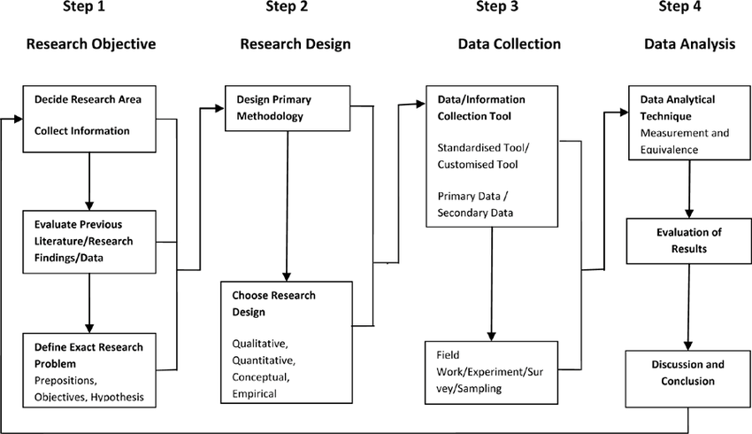
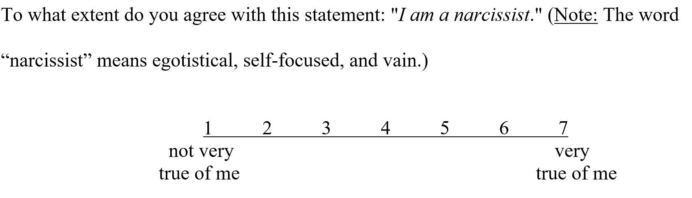

Tidying Survey Data in R
======================

Foundations For Research Computing - Columbia University
--------------------------------

## Part 1 - Principles of Survey Research

### Research Process

{ width=75%}

### What is a survey?

A survey is a research tool used for collecting data from a group of interest to gain insight on a topic of interest. The tool relies on a series of openeded and/or closed questions which when answered and collected serve as the data for a research study.

How to create a survey

1. Clearly define a topic
2. Write questions focused on this topic* 
3. Decide how to administer the survey
4. Pilot test the survey

------------------------------------------------------------------------

### Questionnaire Construction

The research design influences the survey design through questionnaire construction. Depending on the research question and the methodology through which it will be studied, the items in the survey will include some of the following types of questions.

#### Open-ended items 

Respondents are asked to answer questions in their own words

* Why did you vote the way you did in the last election?
* Why did you decide to attend Cornell?
* What are three characteristics you look for in a friend?

#### Restricted (closed-ended) items 

Respondents are given a list of alternatives and mark the desired alternative 

* Which candidate did you vote for in the last presidential election? 
  - ___ Clinton 
  - ___ Trump 
  - ___ Someone else 
  - ___ Did not vote

#### Partially open-ended items

An “Other” alternative is added to a restricted item, allowing the respondent to write in an alternative

* What is your primary reason for attending college? 
  - ___ To be able to get a job when I graduate 
  - ___ To learn about interesting topics 
  - ___ To make new friends 
  - ___ Other (please specify): _______________

#### Rating scale items 

Respondents select a number/option on a scale that reflects a “how much” judgment. 
A little more complicated but if the following are carefully managed it can be an effective item. 

1. Number of points on the scale 
2. How to number the scale (e.g., -3 to +3 vs. 1 to 7) 
3. Whether your scale has a midpoint 
4. How to label the scale (label mid or endpoints/Unipolar or bipolar scale)

* {width=50%}

#### Tips on Creating Good Questions

##### Item grammar and structure

* Make each item simple and easy to understand.
  - Avoid technical terms, use proper grammar, etc. 
  - Ask exactly what you want to know. 
* Avoid double-barreled questions. 
  - How much do you like this toy and believe that it will be a top-seller?
* Avoid loaded questions and questions with emotionally-charged words. 
  - Do you think stealing stamps from your employer is wrong?
* Avoid negative wording. 
  - Do you think the university should not require undergrads to live on campus?
* Avoid words like “always” and “never” in the text of your item. 
* Rating-scale item of “I never wake up early.” 
* Avoid “check all that apply” items. 
* Having a rating scale for each alternative is preferred.

##### Survey item structure

* Organize questions into a coherent, visually pleasing format.
* Use an interesting question as your first item. 
* Put demographic items at the end.
* Keep related items together. 
* Place sensitive/objectionable items after less sensitive/objectionable items. 
* Establish a logical navigational path. 
* Be aware that question order can make a difference.
* Have some reverse-scored questions in a series. 
* Consider including items that test to see if participants are paying attention if the questionnaire is long. 
* Remember that longer scales are more reliable.
* Make sure participants are able to answer in a way that can confirm or disconfirm your hypothesis.

------------------------------------------------------------------------

### Scales of measurement

Different ways of measuring variables give you different types/amounts of information 

The scales, in order from least to most information provided about the values along the scale, are: 

* Nominal 
* Ordinal 
* Interval 
* Ratio

How do you operationally define a good math student? 

* Nominal: Teacher votes yes/no 
* Ordinal: Grade in class (A, B, C, D, or F) 
* Interval: Rating by teacher on a 1-7 scale
* Ratio: Number of problems correct on a cumulative test

------------------------------------------------------------------------

### Measurement Concepts

Key to any survey is ensuring that questions asked are reliable and valid in terms of what they are attempting to measure. Assessments as described below must be taken to ensure that survey is properly measuring the topic of interest.

#### Reliability

Consistency or stability of a measure 

Types of Measures

1. Test-retest reliability 
2. Internal consistency 
3. Interrater reliability

##### Test-retest Reliability

Degree to which people have similar responses when they are measured on two different occasions

* Can be calculated by taking the correlation between scores at Time 1 and Time 2
  - Want large, positive correlations (at least r = .7)

##### Internal Consistency

Degree to which items in the survey are all compatable

* Usually measured using Cronbach's Alpha 
  -(Larger alphas the better)
* Split-half reliability (the degree to which the two halves of the survey elicit similar responses)

##### Interrater Reliability

The degree to which raters agree in their observations or categorizations 

- Percent agreement 
- Cohen’s kappa 
- Pearson r 
- ICC

#### Validity

The extent to which your instrument measures what it was designed to measure

Types of construct validity

1. Face validity
2. Content validity
3. Concurrent validity
4. Predictive validity 
5. Convergent validity
6. Discriminant validity

##### Face validity 

The content appears to measure what it was designed to measure 

##### Content Validity

The content was adequately sampled from the larger universe of behaviors the test was designed to measure

##### Concurrent Validity

Scores on the measure are related to a criterion measured at the same time (usually group differences) 

##### Predictive Validity

Scores on the measure predict behavior on a criterion measured in the future 

##### Convergent Validity

Scores on the measure are related to other measures of the same construct 

##### Discriminant Validity

Scores on the measure are not related to other measures that are theoretically different

#### Example of Reliability and Validity Assessment

Single Item Narcissism Scale (SINS)

Likert scale question as the following:

{ width=75%}

Reliability

* Good test-retest reliability, r = .79
* Pilot testing achived high interrater reliability 

Validity

* Developed the item to have good face validity
* Concurrent validity – people in committed relationships scored lower on the SINS 
* Predictive validity – higher scores on the SINS predicted less helping after being threatened 
* Convergent validity – the SINS was correlated with various other measures of narcissism, such as the NPI 
* Discriminant validity – the SINS was uncorrelated with a measure of Right Wing Authoritarianism

Conclusion 

SINS is a reliable and valid survey item for measuring narcissim, however, it has some drawbacks such as being susceptible to random errors of measurement which could be averaged out with longer surveys. Moreover, like most single item scales, it risks simplifying complex concepts. Can read more about this study [here.](https://journals.plos.org/plosone/article?id=10.1371/journal.pone.0103469)

------------------------------------------------------------------------

### Administer a survey

Depending on the size, demographics and other key characteristics of the population of interests, the survey may be administered through questionnaires or interviews. 

Questionnaires

A medium through which group of interests answers a survey directly without any intervention. Although surveys can be sent multiple times, during the response there are no interventions.

* In person
  - Individual or group setting
* Mail 
* Internet 

Interviews

A medium through which a researchers administers a questionnaire (verbally typically) to the group of interests. Depending on the research design, it can involve intervention during administration of survey.

* Telephone 
* Face-to-face 
* Focus groups